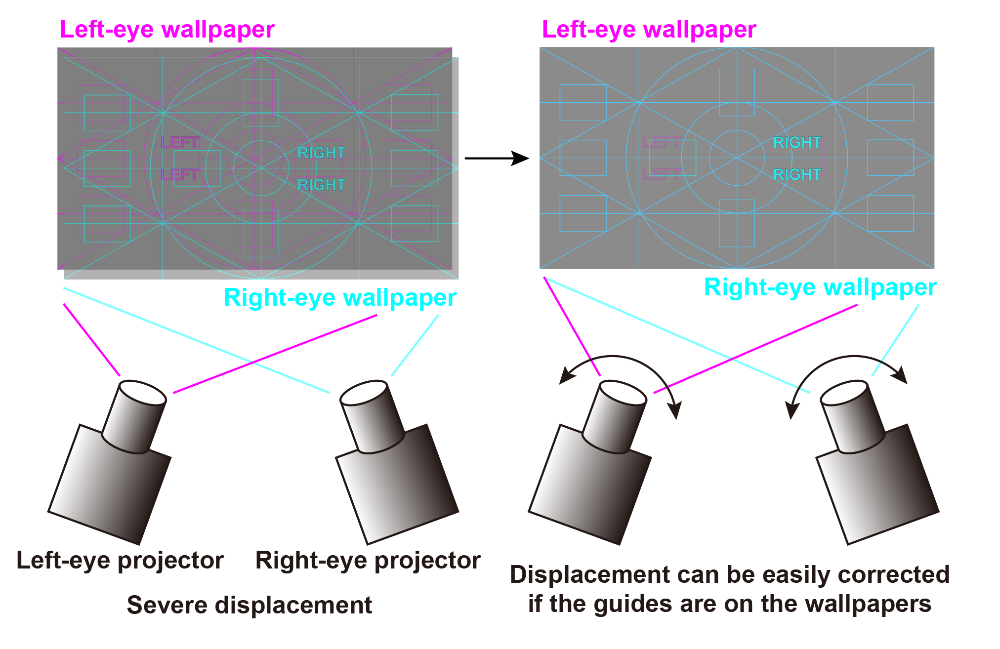

# **README on BinocularDisplayChecker**

<div>Created    : "2016-01-17 14:57:53 ban"</div>
<div>Last Update: "2021-06-17 00:55:47 ban"

**********

# <a name = "Menu"> **BinocularDisplayChecker -- Left/right-eye image position adjustment tool** </a>



This **MATLAB** tool generates a series of wallpapers with some guidelines shown in the illustration.  
In neuroimaging and psychophysics experiments, when we are going to use some binocular visual stimulus (e.g. stereograms, or binocular rivalry), we may have to present left- and right-eye images onto two independent displays/projectors separately (and we may further use an additional display for a console). In such a situation, a strict adjustment of the two display projection positions will be necessary for accurate binocular fusion and precise measurements. To this end, some background wallpaper image with which we can easily detect displacement by visual inspection is required. The wallpaper(s) generated by this tool can support these corrections by presenting guidelines/rulers on the screen.  

For generating guideline wallpapers, this toolbox provides two different ways as below.
1. The images with the required size are first generated by a MATLAB function, and then the wallpapers are drawn by combining these images.
   Please use **GenerateBinocularWallpaperGen** for this method. **Psychtoolbox** is required.  
2. The pre-existing PNG images (stored in ~/BinocularDisplayChecker/pngs/) are copied and combined to make the required wall papers.
   You can use **GenerateBinocularWallpaperCopy** for this method.  

   Here, this second procedure is easier and simpler, while it may not be user friendly only limited pairs of display resolutions can be accepted since pre-existing images with fixed image sizes. However, I still keep and prefer this second procedure as we can embed outlined polished texts on the images by using the Adobe Illustrator's font drawing functionality.  

For the pragmatic purpose, there would be no difference between these two procedures. Please select one based on your own preference.

**examples**

```Matlab
>> GenerateBinocularWallpaperGen([1920,1200;1920,1080;1920,1080],[127,127,127]);
>> GenerateBinocularWallpaperGen([0,0;1920,1080;1920,1080],[127,127,127]);
>> GenerateBinocularWallpaperCopy([1920,1200;1920,1080;1920,1080],[127,127,127]);
>> GenerateBinocularWallpaperCopy([0,0;1920,1080;1920,1080],[127,127,127]);
```

**usage**

```Matlab
function GenerateBinocularWallpaperGen(ress,:bgcolor)
function GenerateBinocularWallpaperCopy(ress,:bgcolor)
(: is optional)
```

**input (common between the two functions)**

<pre>
ress: display resolutions, a 3 x 2 matrix.
      [width_display_1, height_display_1; width_display_2, height_display_2; width_display_3, height_display_3]
      here, display 1 is for a console, display 2 is for presenting left-eye image, and display 2 is for
      presenting right-eye image.
      e.g. ress=[1920,1200; 1920, 1080; 1920, 1080].

      NOTE 1: if you don't use the console display (display 1) or the right-eye-image (display 3),
              please set 0 to ress of these displays.
              e.g. ress=[0,0; 1920, 1080; 1920, 1080]; or ress=[0,0;0,0;1920,1080];

      NOTE 2: currently, only specific pairs of the display resolutions listed below are available
              since the images are prepared in advance. if you need different resolutions, please generate
              PNG wallpaper materials in advance using some graphics software.
              available: [1024, 768], [1280,1024], [1920,1080], [1920,1200], and [2560, 1440] (width,height).
bgcolor : (optional) background to be used on the console display (display 1)
          bgcolor=[127,127,127] by default.
</pre>

**output (common between the two functions)** 

<pre>
no output variable, the generated wallpaper image is saved in the current directory as wallpaper_[1|2|3]_display*.png
</pre>

**NOTE**

Some other tools (images) that can be used to check whether the binocular display setups are properly done are also available.  
Please see the files in ~/BinocularDisplayChecker/stereo_checker.  
